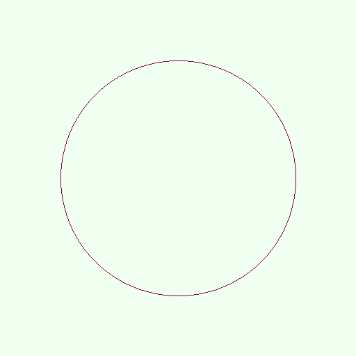

# Midpoint Circle Visualization Demo

## Overview
[Midpoint Circle Visualization](https://en.wikipedia.org/wiki/Midpoint_circle_algorithm) algorithm implementation in C. Visualization is done via outputing [PPM images](http://netpbm.sourceforge.net/doc/ppm.html). 
Inspired by [Tsoding](https://www.twitch.tv/tsoding) who implemented this thing in Rust.

## Quick Start

```console
$ make
$ ./mcv
```

## Screenshots
 
